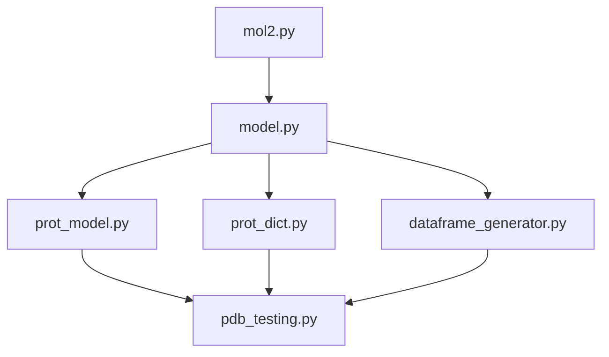

# BCN-binding-site
## Table of Contents
- [BCN-binding-site](#bcn-binding-site)
  - [Table of Contents](#table-of-contents)
  - [Introduction](#introduction)
  - [Training](#training)
  - [Requirements](#requirements)
  - [Command line Installation](#command-line-installation)
  - [Usage](#usage)
    - [Training](#training-1)
  - [Theory](#theory)
  - [License](#license)
  - [References](#references)

## Introduction
This project is designed to determine the binding site of protein using supervised machine learning.

## Training
We will use the subset of the scPDB dataset generated by the PUResNET team. We will also use the BindingDB as a simple visual validation set. 

We extracted the PDB files from the datasets with only PDBs included in articles, the subset of files drawn from the ChEMBL, and also the subset of the files from patents. And more…

## Requirements
This is an Python script that particularly uses the following dependencies:
- Pytorch 

## Command line Installation

```bash
git clone https://github.com/EduardoCantos1998/TrabajoFinalSBI-PYT
```

Now we prepare the environemnt for installation:

```bash
# Create a virtual environment:
python -m venv venv # Or name it as desired 
source venv/bin/activate
pip install -r requirements.txt
cd Code
```
## Usage 
This is the workflow for the general use of the tool:


Starting with `Code/mol.py`, The `get_protein`, `get_proteinCA`, and `get_proteinCB` methods extract the coordinates of all atoms, alpha-carbons (CA), and beta-carbons (CB), `get_cavity`, `get_site`, `get_siteCA`, `get_siteCB` in binding cavity, binding site, and ligand of the protein from the PDB file, and return them as NumPy matrices.

Then `model.py` call 3 different scripts to create an unique pickle. The scripts called are:
- `prot_model.py`:
- `prot_dict.py`: 
- `dataframe_generator.py`:

Finally`pdb_testing.py` takes the `model.pkl` and does a prediction based.

Others:
- `mol2pdb.py`, which downloads PDB (Protein Data Bank) and FASTA files for a list of protein codes, which are present in the `"final_data/"` directory.


### Training
Training a model for protein-ligand binding prediction requires a large and diverse dataset that represents a wide range of protein-ligand interactions. In this project, we will be using the subset of the scPDB dataset generated by the PUResNET team as our primary training dataset.

## Theory
Protein–protein interactions (PPIs) are central to biological systems; and predicting the interacting residues is useful for constructing PPI networks, analysing mutations, drug design, drug discovery and improve annotation of protein funciton. But 3-dimension structures and their interactions is not short of complexity issues that could not be evaluated before. larger datasets and GPU acceleration have enabled the training of deeper neural network architectures.

Broadly there are 3 categories for PPI site prediction: 
- PP docking methods: seek to reproduce structures on the resulting protein complex;
- Structure-based methods
- Sequence-based methods: 
 


There are a number of actively developed machine learning frame- works. A popular choice for traditional ML is SciKit-Learn (https://scikit-learn.org/stable/). For deep learning frameworks, popular choices include: PyTorch (https://pytorch.org), TensorFlow (https://www.tensorflow.org), and Theano (http://deeplearning.net/software/theano/).

## [License](LICENSE)

## References
1. Das S, Chakrabarti S. Classification and prediction of protein–protein interaction interface using machine learning algorithm. Sci Rep. 2021 Jan 19;11(1):1761. 
2. Kandel J, Tayara H, Chong KT. PUResNet: prediction of protein-ligand binding sites using deep residual neural network. Journal of Cheminformatics. 2021 Sep 8;13(1):65. 


