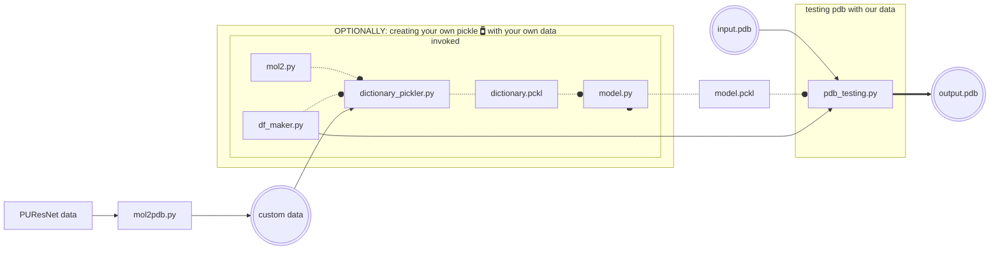

# SBIXPYT: RF approach for PLI

## Table of Contents
- [SBIXPYT: RF approach for PLI](#sbixpyt-rf-approach-for-pli)
  - [Table of Contents](#table-of-contents)
  - [Introduction](#introduction)
  - [Training](#training)
  - [Script description](#script-description)
  - [Requirements](#requirements)
  - [Command line Installation](#command-line-installation)
  - [Usage (Tutorial)](#usage-tutorial)
    - [Running the code](#running-the-code)
  - [Output](#output)
  - [Theory](#theory)
  - [Result Benchmark (Analysis)](#result-benchmark-analysis)
  - [License](#license)
  - [References](#references)

## Introduction
This project is designed to determine the binding site of proteins using Random Forest (RF).
The program takes a PDB file and generates an output called output.pdb that has information that can be visualized in [Jmol](https://jmol.sourceforge.net/), [PyMOL](https://pymol.org/2/), [UCSF Chimera](https://www.cgl.ucsf.edu/chimera/index.html), etc.

## Training
We will use the subset of the scPDB dataset generated by the [PUResNet](#references) team as an starting point. Particularly we used the following data from their [repository](https://github.com/jivankandel/PUResNet): `protein.mol2`, `site.mol2`. We added the .pdb files using `mol2pdb.py` and used them for training.
We will also use the BindingDB as a simple visual validation set.
We extracted the PDB files from the datasets with only PDBs included in articles, the subset of files drawn from the ChEMBL, and also the subset of the files from patents and those published in papers. 

## Script description
- `Code/mol2.py`: `get_protein`, `get_proteinCA`, and `get_proteinCB` methods extract the coordinates of all atoms, alpha-carbons (CA), and beta-carbons (CB), `get_cavity`, `get_site`, `get_siteCA`, `get_siteCB` in binding cavity, binding site, and ligand of the protein from the PDB file, and return them as NumPy matrices.
which downloads PDB (Protein Data Bank) and FASTA files for a list of protein codes, which are present in the `"final_data/"` directory.
- `mol2pdb.py`: Extracts the IDs from each folder and retrieves the pdb file from [RCSB](https://files.rcsb.org/).
- `df_maker.py`: extracts features (coordinates, aminoacid, binding atom, entropy, charge, hidrophobicity, secundary structure, solvent accessible surface area(SASA), b-factor, phi and psi angles and alpha-carbon distance). betacarbons; and generates a pandas dataframe and converts them to integers.
- `dictionary_pickler.py`: it iterates the proteins to generate a dataframe using `df_maker.py`; and keeps them in a dictionary. It could be considered the first selection step because we create a sample from the database (5020).
- `DATA.py`: this is used to extract the PDB codes from the BindingDB tsv and download into a folder in the same directory called "PDB". A zip of this can be found in the DATA folder.

## Requirements
This is an Python script that particularly uses the following dependencies to take into account: biopython, df_maker, freesasa, mol2, numpy, pandas, scikit-learn, dssp.

## Command line Installation

```bash
git clone https://github.com/EduardoCantos1998/TrabajoFinalSBI-PYT
cd TrabajoFinalSBI-PYT
```

and proceed to create a python env to run the scripts.

```bash
# Create a virtual environment:
python -m venv venv # Or name it as desired 
source venv/bin/activate
pip install -r requirements.txt
```

## Usage (Tutorial)
This is the workflow for the general use of the tool:


It takes as an input a PDB file which is evaluated using `model.py` then; the output will be a list of the aminoacids and sites belonging to a binding site. 

### Running the code
We go to the folder
```bash
cd Code
python3 pdb_testing.py [PATH_TO_PROTEIN]
```
In case the user wants to use its own model; as an option is also possible to:
```bash
python3 pdb_testing.py [PATH_TO_PROTEIN] [PATH_TO_MODEL]
```

## Output
This is an example of the output, as a concept:

```
binding_site_prediction = [0, 0, 1, 1, 0, 1, 1, 0, 0, 0, 1, 1]
amino_acids = ['A', 'C', 'D', 'E', 'F', 'G', 'H', 'I', 'K', 'L', 'M', 'N']

# Obtener los aminoácidos que corresponden con el binding site
binding_site_amino_acids = [amino_acids[i] for i, val in enumerate(binding_site_prediction) if val == 1]

print(binding_site_amino_acids)
# Output: ['D', 'E', 'G', 'H', 'M', 'N']
```
And the following output files:
- `{name}.pdb`
- `{name}_binding_site_predictions.txt`
- `{name}_prediction.pdb`

Displayed in UCSFChimera:

_**Fig. 1**: This is an visualization of the results, being beige the local sequence; being blue the prediction and red the XFC ligand for this interaction._

## [Theory](theory.md)
## Result Benchmark (Analysis)

Regarding the efficiency of our tool we tried calculating the Root Mean Square Deviation (RMSD) between the predicted site and the actual site. RMSD is a measure of the difference between two sets of coordinates. In this case, we calculated the RMSD between the predicted site and the actual site using a software tool such as PyMOL or VMD. To do this, we aligned the predicted site with the actual site using a structural superposition algorithm. Then, calculated the RMSD between the aligned sets of coordinates. If the RMSD value was low (typically less than 2 Å), this indicated a good prediction. If the RMSD value was high, this indicated a poor prediction.  
In addition to RMSD, other metrics can also be used to evaluate ligand site predictions, such as the enrichment factor or the area under the receiver operating characteristic curve (AUC-ROC).

## [License](LICENSE)

## References
1. Das S, Chakrabarti S. Classification and prediction of protein–protein interaction interface using machine learning algorithm. Sci Rep. 2021 Jan 19;11(1):1761. 
2. Jamasb AR, Day B, Cangea C, Liò P, Blundell TL. Deep Learning for Protein–Protein Interaction Site Prediction. In: Cecconi D, editor. Proteomics Data Analysis [Internet]. New York, NY: Springer US; 2021 [cited 2023 Apr 5]. p. 263–88. (Methods in Molecular Biology). Available from: https://doi.org/10.1007/978-1-0716-1641-3_16
3. Kabsch W, Sander C. Dictionary of protein secondary structure: Pattern recognition of hydrogen-bonded and geometrical features. Biopolymers. 1983 Dec;22(12):2577–637. 
4. Mahesh B. Machine Learning Algorithms -A Review. 2019. 
5. Casadio R, Martelli PL, Savojardo C. Machine learning solutions for predicting protein–protein interactions. WIREs Comput Mol Sci [Internet]. 2022 Nov [cited 2023 Apr 5];12(6). Available from: https://onlinelibrary.wiley.com/doi/10.1002/wcms.1618
6. Ma W, Bao W, Cao Y, Yang B, Chen Y. Prediction of Protein-Protein Interaction Based on Deep Learning Feature Representation and Random Forest. In: Huang DS, Jo KH, Li J, Gribova V, Premaratne P, editors. Intelligent Computing Theories and Application. Cham: Springer International Publishing; 2021. p. 654–62. (Lecture Notes in Computer Science). 
7. Šikić M, Tomić S, Vlahoviček K. Prediction of Protein–Protein Interaction Sites in Sequences and 3D Structures by Random Forests. Stormo GD, editor. PLoS Comput Biol. 2009 Jan 30;5(1):e1000278. 
8. Raza K. Protein features identification for machine learning-based prediction of protein-protein interactions [Internet]. Bioinformatics; 2017 May [cited 2023 Apr 5]. Available from: http://biorxiv.org/lookup/doi/10.1101/137257
9. Kandel J, Tayara H, Chong KT. PUResNet: prediction of protein-ligand binding sites using deep residual neural network. Journal of Cheminformatics. 2021 Sep 8;13(1):65. 
10. Ho TK. Random decision forests. In: Proceedings of 3rd International Conference on Document Analysis and Recognition. 1995. p. 278–82 vol.1. 
11. Pedregosa F, Varoquaux G, Gramfort A, Michel V, Thirion B, Grisel O, et al. Scikit-learn: Machine Learning in Python. Journal of Machine Learning Research. 2011;12(85):2825–30. 
