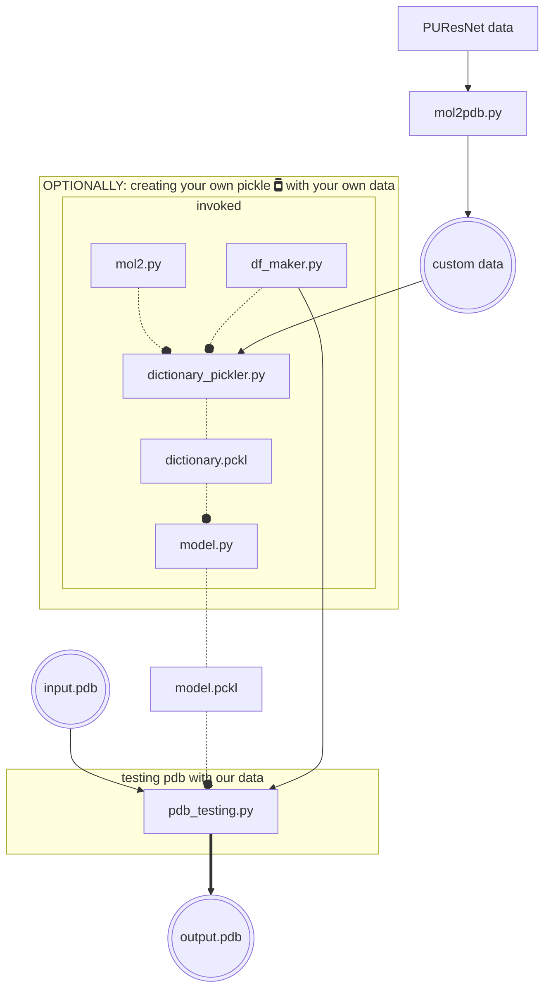

# BCN-binding-site
## Table of Contents
- [BCN-binding-site](#bcn-binding-site)
  - [Table of Contents](#table-of-contents)
  - [Introduction](#introduction)
  - [Training](#training)
    - [Trained Data](#trained-data)
  - [Requirements](#requirements)
  - [Command line Installation](#command-line-installation)
  - [Usage (Tutorial)](#usage-tutorial)
    - [Creating your own pickle :green\_book:](#creating-your-own-pickle-green_book)
      - [Adding the PDB](#adding-the-pdb)
  - [Theory](#theory)
  - [Result Benchmark (Analysis)](#result-benchmark-analysis)
  - [License](#license)
  - [References](#references)

## Introduction
This project is designed to determine the binding site of proteins using Random Forest (RF).
The program takes a PDB file and generates an output called output.pdb that has information that can be visualized in [Jmol](https://jmol.sourceforge.net/), [PyMOL](https://pymol.org/2/), [UCSF Chimera](https://www.cgl.ucsf.edu/chimera/index.html), etc.

## Training
We will use the subset of the scPDB dataset generated by the [PUResNet](#references) team as an starting point. Particularly we used the following data from their [repository](https://github.com/jivankandel/PUResNet): `protein.mol2`, `site.mol2`. 


- `mol2.py`
- `protein.pbd`

We will also use the BindingDB as a simple visual validation set.
We extracted the PDB files from the datasets with only PDBs included in articles, the subset of files drawn from the ChEMBL, and also the subset of the files from patents. And more…
### Trained Data
Training a model for protein-ligand binding prediction requires a large and diverse dataset that represents a wide range of protein-ligand interactions. In this project, we will be using the subset of the scPDB dataset generated by the PUResNET team as our primary training dataset.


## Requirements
This is an Python script that particularly uses the following dependencies to take into account: biopython, df_maker, freesasa, mol2, numpy, pandas, scikit-learn, dssp.

## Command line Installation

```bash
git clone https://github.com/EduardoCantos1998/TrabajoFinalSBI-PYT
cd TrabajoFinalSBI-PYT
```

and proceed to create a python env to run the scripts.

```bash
# Create a virtual environment:
python -m venv venv # Or name it as desired 
source venv/bin/activate
pip install -r requirements.txt
```

```bash
cd Code
```
## Usage (Tutorial)
This is the workflow for the general use of the tool:


It takes as an input a PDB file which is evaluated using `model.py` then; the output will be a list of the aminoacids and sites belonging to a binding site. 


This is an example of the output:

```
binding_site_prediction = [0, 0, 1, 1, 0, 1, 1, 0, 0, 0, 1, 1]
amino_acids = ['A', 'C', 'D', 'E', 'F', 'G', 'H', 'I', 'K', 'L', 'M', 'N']

# Obtener los aminoácidos que corresponden con el binding site
binding_site_amino_acids = [amino_acids[i] for i, val in enumerate(binding_site_prediction) if val == 1]

print(binding_site_amino_acids)
# Output: ['D', 'E', 'G', 'H', 'M', 'N']
```

Starting with `Code/mol.py`, The `get_protein`, `get_proteinCA`, and `get_proteinCB` methods extract the coordinates of all atoms, alpha-carbons (CA), and beta-carbons (CB), `get_cavity`, `get_site`, `get_siteCA`, `get_siteCB` in binding cavity, binding site, and ligand of the protein from the PDB file, and return them as NumPy matrices.

Finally`pdb_testing.py` takes the `model.pkl` and does a prediction based.

Invoked scripts:
- `mol2pdb.py`, which downloads PDB (Protein Data Bank) and FASTA files for a list of protein codes, which are present in the `"final_data/"` directory.
- `df_maker`

### Creating your own pickle :green_book:
To extend the usability of the tools provided, we also give instructions on how to use the scripts to create a custom pickle to run Random Forest on the user data.

As seen in the flowchart; it's possible to add personal data for testing; nevertheless there are some caveats in usage; particularly the formatting of the data.
#### Adding the PDB

## [Theory](theory.md)

## Result Benchmark (Analysis)
Regarding the efficiency of our tool we tried calculating the Root Mean Square Deviation (RMSD) between the predicted site and the actual site. RMSD is a measure of the difference between two sets of coordinates. In this case, we calculated the RMSD between the predicted site and the actual site using a software tool such as PyMOL or VMD. To do this, we aligned the predicted site with the actual site using a structural superposition algorithm. Then, calculated the RMSD between the aligned sets of coordinates. If the RMSD value was low (typically less than 2 Å), this indicated a good prediction. If the RMSD value was high, this indicated a poor prediction.  
In addition to RMSD, other metrics can also be used to evaluate ligand site predictions, such as the enrichment factor or the area under the receiver operating characteristic curve (AUC-ROC).


## [License](LICENSE)

## References
1. Das S, Chakrabarti S. Classification and prediction of protein–protein interaction interface using machine learning algorithm. Sci Rep. 2021 Jan 19;11(1):1761. 
2. Šikić M, Tomić S, Vlahoviček K. Prediction of Protein–Protein Interaction Sites in Sequences and 3D Structures by Random Forests. Stormo GD, editor. PLoS Comput Biol. 2009 Jan 30;5(1):e1000278. 
3. Kandel J, Tayara H, Chong KT. PUResNet: prediction of protein-ligand binding sites using deep residual neural network. Journal of Cheminformatics. 2021 Sep 8;13(1):65. 


