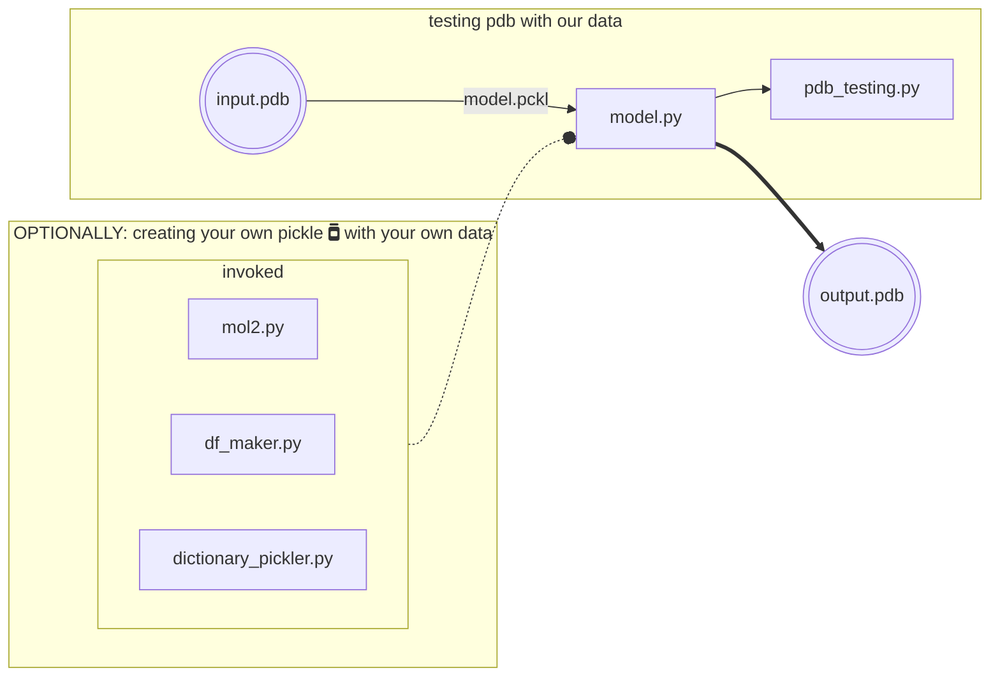

# BCN-binding-site
## Table of Contents
- [BCN-binding-site](#bcn-binding-site)
  - [Table of Contents](#table-of-contents)
  - [Introduction](#introduction)
  - [Training](#training)
  - [Requirements](#requirements)
  - [Command line Installation](#command-line-installation)
  - [Usage](#usage)
    - [Creating your own pickle :green\_book:](#creating-your-own-pickle-green_book)
      - [Adding the PDB](#adding-the-pdb)
    - [Trained Data](#trained-data)
  - [Theory](#theory)
    - [Random Forest](#random-forest)
  - [Quality results](#quality-results)
    - [DSSP](#dssp)
  - [License](#license)
  - [References](#references)

## Introduction
This project is designed to determine the binding site of protein using supervised machine learning, particularly through random forest.

## Training
We will use the subset of the scPDB dataset generated by the PUResNET team. We will also use the BindingDB as a simple visual validation set. 

We extracted the PDB files from the datasets with only PDBs included in articles, the subset of files drawn from the ChEMBL, and also the subset of the files from patents. And more…

## Requirements
This is an Python script that particularly uses the following dependencies to take into account.

## Command line Installation

```bash
git clone https://github.com/EduardoCantos1998/TrabajoFinalSBI-PYT
cd TrabajoFinalSBI-PYT
```

and proceed to create a python env to run the scripts.

```bash
# Create a virtual environment:
python -m venv venv # Or name it as desired 
source venv/bin/activate
pip install -r requirements.txt
```

```bash
cd Code
```
## Usage 
This is the workflow for the general use of the tool:


It takes as an input a PDB file which is evaluated using... then; the output will be a list of the aminoacids and sites belonging to a binding site. 

This is an example of the output:

```
binding_site_prediction = [0, 0, 1, 1, 0, 1, 1, 0, 0, 0, 1, 1]
amino_acids = ['A', 'C', 'D', 'E', 'F', 'G', 'H', 'I', 'K', 'L', 'M', 'N']

# Obtener los aminoácidos que corresponden con el binding site
binding_site_amino_acids = [amino_acids[i] for i, val in enumerate(binding_site_prediction) if val == 1]

print(binding_site_amino_acids)
# Output: ['D', 'E', 'G', 'H', 'M', 'N']
```

Starting with `Code/mol.py`, The `get_protein`, `get_proteinCA`, and `get_proteinCB` methods extract the coordinates of all atoms, alpha-carbons (CA), and beta-carbons (CB), `get_cavity`, `get_site`, `get_siteCA`, `get_siteCB` in binding cavity, binding site, and ligand of the protein from the PDB file, and return them as NumPy matrices.

Finally`pdb_testing.py` takes the `model.pkl` and does a prediction based.

Invoked scripts:
- `mol2pdb.py`, which downloads PDB (Protein Data Bank) and FASTA files for a list of protein codes, which are present in the `"final_data/"` directory.
- `df_maker`

### Creating your own pickle :green_book:
To extend the usability of the tools provided here we also give instructions on how to use the scripts to create a custom pickle to run Random Forest on your own data.

#### Adding the PDB

### Trained Data
Training a model for protein-ligand binding prediction requires a large and diverse dataset that represents a wide range of protein-ligand interactions. In this project, we will be using the subset of the scPDB dataset generated by the PUResNET team as our primary training dataset.

## Theory
Protein–protein interactions (PPIs) are central to biological systems; and predicting the interacting residues is useful for constructing PPI networks, analysing mutations, drug design, drug discovery and improve annotation of protein funciton.
Experimental techniques commonly employed to determine the structure of protein complexes at atomic-scale resolution include X-ray crystallography nuclear mag- netic resonance (NMR) spectroscopy, and cryo-electron microscopy (cryo-EM). Information about interface residues can also be obtained by alanine scanning mutagenesis experiments or various footprinting experiments, such as hydrogen/deuterium exchange or hydroxy radical footprinting. As they may come useful they have the problem of still being currently expensive and low throughput. That's why in silico techniques could prove useful to fill the gap and determine 3D structure and interactions, specially given current available knowledge, larger datasets and that GPU acceleration have enabled the training of deeper neural network architectures. Broadly, there are 3 categories for PPI site prediction: a method focused in Machine Learning; Structure-based methods and Sequence-based methods.
 


There are a number of actively developed machine learning frameworks. A popular choice for traditional ML is SciKit-Learn (https://scikit-learn.org/stable/). For deep learning frameworks, popular choices include: PyTorch (https://pytorch.org), TensorFlow (https://www.tensorflow.org), and Theano (http://deeplearning.net/software/theano/).

For our approach we decided to do Random Forest.

### Random Forest
Random Forests is an ensemble method that combines several individual classification trees in the following way: from the original sample several bootstrap samples are drawn, and an unpruned classification tree is fitted to each bootstrap sample. The feature selection for each split in the classification tree is conducted from a small random subset of predictor variables (features). From the complete forest the status of the response variable is predicted as an average or majority vote of the predictions of all trees.

## Quality results
Regarding the efficiency of our tool we tried calculating the Root Mean Square Deviation (RMSD) between the predicted site and the actual site. RMSD is a measure of the difference between two sets of coordinates. In this case, we calculated the RMSD between the predicted site and the actual site using a software tool such as PyMOL or VMD. To do this, we aligned the predicted site with the actual site using a structural superposition algorithm. Then, calculated the RMSD between the aligned sets of coordinates. If the RMSD value was low (typically less than 2 Å), this indicated a good prediction. If the RMSD value was high, this indicated a poor prediction.  
In addition to RMSD, other metrics can also be used to evaluate ligand site predictions, such as the enrichment factor or the area under the receiver operating characteristic curve (AUC-ROC).

### DSSP
We used

## [License](LICENSE)

## References
1. Das S, Chakrabarti S. Classification and prediction of protein–protein interaction interface using machine learning algorithm. Sci Rep. 2021 Jan 19;11(1):1761. 
2. Šikić M, Tomić S, Vlahoviček K. Prediction of Protein–Protein Interaction Sites in Sequences and 3D Structures by Random Forests. Stormo GD, editor. PLoS Comput Biol. 2009 Jan 30;5(1):e1000278. 
3. Kandel J, Tayara H, Chong KT. PUResNet: prediction of protein-ligand binding sites using deep residual neural network. Journal of Cheminformatics. 2021 Sep 8;13(1):65. 


